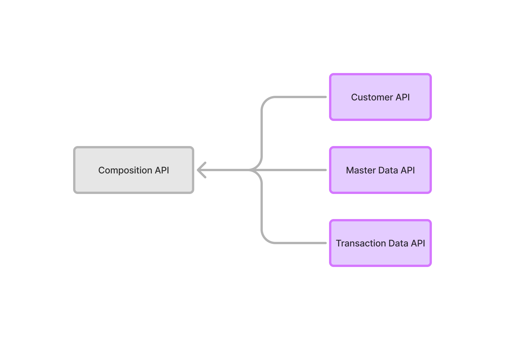

# Designing a way to grab data from all of 3 services with near-realtime data stream

The easeist way that not require any new tech stack introduce in already running microservices is create a Composition API Layer that fetches data from each microservice in parallel upon request.



Composition Layer get all data from 3 services by fetch requests from each services. Create new service for fetching requests from all 3 services by using tech stack like Python, Java or in this example case using JavaScript with Express.js and Fetch API.

```ts
const customerAPI = 'http://customer-service/api/v1/customer';
const masterDataAPI = 'http://masterdata-service/api/v1/data';
const transactionAPI = 'http://transaction-service/api/v1/transaction';

app.get('/api/v1/aggregated-data', async (req, res) => {
    try {
        // Fetch data from each service
        const [customer, master, transaction] = await Promise.all([
            fetch(customerAPI),
            fetch(masterDataAPI),
            fetch(transactionAPI)
        ]);

        // Combine the data as needed
        const aggregatedData = {
            customer: customer.json(),
            masterData: master.json(),
            transactions: transaction.json(),
        };

        // Send the combined response
        res.json(aggregatedData);
    } catch (error) {
        console.error('Error fetching data:', error);
        res.status(500).json({ message: 'Error aggregating data' });
    }
});
```

Using `Promise.all()` it's lets all requests occur in parallel. Which improve speed for each request and all data from 3 services come together.